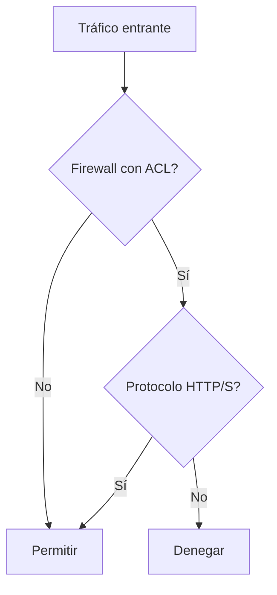

**Definición:** Una función de seguridad en routers y firewalls que define reglas para permitir o denegar tráfico específico basado en direcciones IP, protocolos o puertos. Una serie de declaraciones utilizadas para filtrar el tráfico de red examinando la información de la cabecera del paquete, permitiendo o denegando paquetes basándose en criterios especificados como direcciones IP y números de puerto.

**Ejemplo de uso:** "Para proteger un servidor web, un administrador configura una ACL en un firewall para permitir el tráfico HTTP y HTTPS, pero bloquear todos los demás protocolos."



El siguiente ejemplo muestra cómo configurar una ACL numerada para permitir el tráfico HTTP de la red 10.10.10.0/24 y denegar el resto.

```
Router(config)#access-list 101 permit tcp 10.10.10.0 0.0.0.255 any eq 80
Router(config)#access-list 101 deny ip any any
Router(config)#interface gigabitEthernet 0/1
Router(config-if)#ip access-group 101 in
