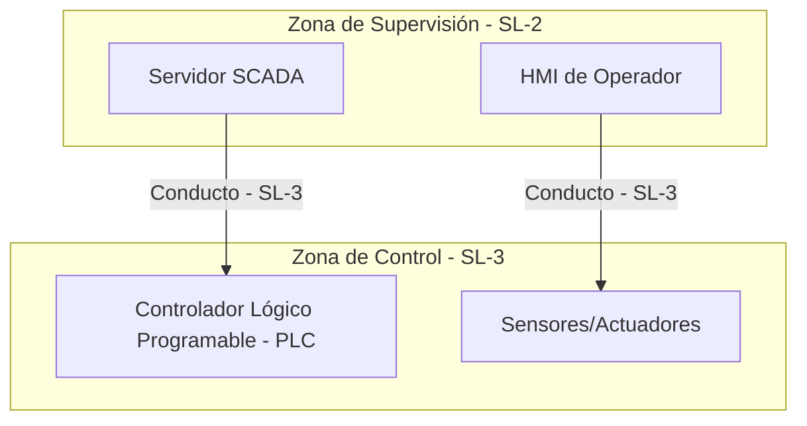

### **Conductos (Conduits)**

Un **conducto** es un canal de comunicación que conecta dos o más **zonas** dentro de una red industrial. Su función principal no es solo la conectividad, sino la de actuar como un punto de control y seguridad. Cada conducto tiene requisitos de seguridad definidos para regular el flujo de datos entre las zonas que protege.

---

### **Desarrollo del concepto de Conducto**

En una arquitectura de ciberseguridad industrial, un conducto es mucho más que un simple cable o una conexión de red. Es un mecanismo de defensa estratégico que se formaliza en estándares como el **ISA/IEC 62443**. Su diseño busca prevenir que un incidente en una zona se propague a otras.

#### **Funciones clave de seguridad**

Un conducto implementa medidas de seguridad específicas para proteger el flujo de datos:

* **Filtrado de tráfico**: El conducto asegura que solo el tráfico autorizado pueda pasar entre las zonas. Esto se logra mediante la inspección de paquetes para verificar que el protocolo, el puerto y la dirección IP de origen y destino sean válidos. Por ejemplo, un firewall configurado para permitir únicamente que el servidor SCADA se comunique con los PLCs actuará como un conducto seguro.
* **Contención de incidentes**: Si una zona es comprometida por un malware o un atacante, el conducto actúa como una barrera que impide que la amenaza se propague a zonas más críticas de la red.
* **Protección de datos**: Los conductos pueden utilizar cifrado para proteger la confidencialidad de los datos que se transmiten entre zonas, algo crucial cuando se comunica entre la red de TI y la de OT.

#### **Relación con las Zonas y los Niveles de Seguridad**

La efectividad de un conducto está directamente relacionada con las zonas a las que conecta. Según el estándar ISA/IEC 62443, a cada conducto se le asigna un **Nivel de Seguridad (SL)** que debe ser igual o superior al nivel de la zona de menor seguridad que conecta. Esto garantiza que la comunicación entre dos zonas se realice de forma segura, incluso si una de ellas tiene requisitos de seguridad más bajos.

**Ejemplo de uso**: Imagina una fábrica dividida en tres zonas:
1.  **Zona de Oficina (SL-1)**: Donde se encuentra la red de TI.
2.  **Zona de Supervisión (SL-2)**: Con los servidores SCADA y las HMI.
3.  **Zona de Control (SL-3)**: Con los PLCs y la maquinaria crítica.

El enlace entre la **Zona de Oficina** y la **Zona de Supervisión** se implementaría a través de un conducto que aplique las políticas de seguridad del Nivel 2. Por otro lado, el enlace entre la **Zona de Supervisión** y la **Zona de Control** requeriría un conducto con medidas de seguridad de Nivel 3, ya que está protegiendo los activos más críticos.

### **Diagrama de un Conducto en una red industrial**

Este diagrama ilustra cómo un conducto conecta de forma segura dos zonas con diferentes niveles de seguridad.

---

### **Referencias normativas**

* **ISA/IEC 62443-3-2**: Este documento es clave para la zonificación, ya que establece la metodología para la evaluación de riesgos de ciberseguridad en el diseño de un sistema.
* **NIST SP 800-82**: La guía de seguridad para sistemas de control industrial del NIST aborda el concepto de seguridad de los conductos como parte de sus recomendaciones sobre la arquitectura de red y los controles de seguridad.
