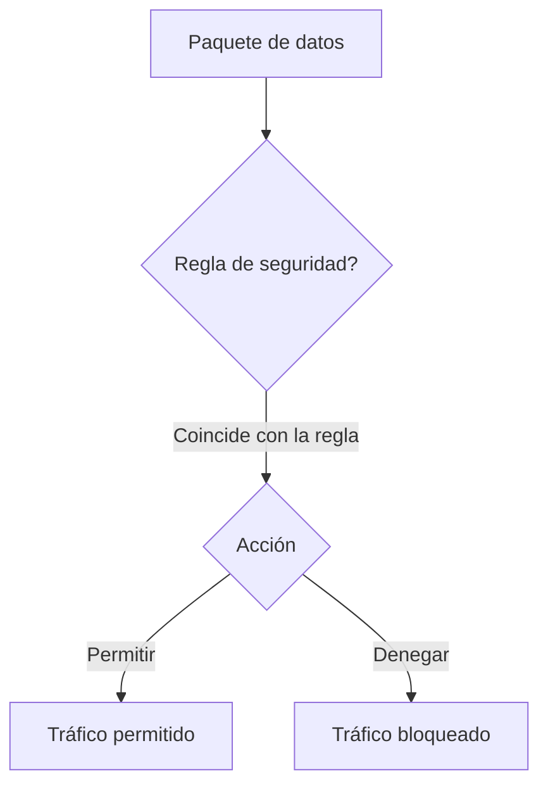

### **Firewall**

Un **firewall** es un dispositivo o software de seguridad que se coloca en los límites de una red para monitorizar y filtrar el tráfico entrante y saliente. Su función principal es actuar como una barrera, permitiendo el paso del tráfico autorizado y bloqueando el tráfico que no cumple con las reglas de seguridad predefinidas.

---

#### **Tipos de firewalls y su funcionamiento**

1.  **Firewalls con estado (Stateful Firewalls)**: Son el tipo más común. Mantienen un registro de todas las conexiones activas, lo que les permite diferenciar entre el tráfico que inicia una conexión y el tráfico que es una respuesta a una conexión ya establecida.
    * **Ejemplo**: Un usuario de la red interna solicita una página web. El firewall registra esta conexión saliente y, cuando la respuesta del servidor web regresa, el firewall la permite porque "sabe" que es una continuación de una conexión legítima.

2.  **Firewalls de Próxima Generación (NGFW)**: Superan a los firewalls tradicionales al añadir funcionalidades avanzadas como la inspección profunda de paquetes (DPI).
    * **Ejemplo**: Un NGFW no solo bloquea el tráfico de un puerto, sino que puede identificar la aplicación que lo genera (por ejemplo, Skype o Netflix) y aplicar políticas de seguridad específicas para esa aplicación, independientemente del puerto que utilice.

---

#### **Firewalls de TI vs. Firewalls de OT**

Aunque ambos cumplen la misma función, los firewalls para **Tecnología de la Información (TI)** y **Tecnología Operativa (OT)** están diseñados para entornos muy diferentes.

| Característica | Firewalls de TI | Firewalls de OT |
| :--- | :--- | :--- |
| **Entorno** | Centros de datos, oficinas. Requieren refrigeración y un entorno limpio. | Plantas de fabricación, subestaciones eléctricas. Soportan condiciones extremas. |
| **Protocolos** | Se centran en protocolos de TI (HTTP, FTP, SSH, SMTP). | Deben entender y asegurar protocolos industriales (Modbus, PROFINET, DNP3, EtherNet/IP). |
| **Diseño físico** | Diseños para rack, compactos. Se utilizan para grandes volúmenes de tráfico. | Diseño **reforzado (rugged)**. Se montan en rieles DIN. Son resistentes al polvo, las vibraciones y las temperaturas extremas. |
| **Rendimiento** | Se mide por el rendimiento de los paquetes y las conexiones por segundo. | Se prioriza la baja latencia y el determinismo. |

---

#### **Ejemplo de filtrado de un firewall**

Este diagrama de Mermaid ilustra cómo un firewall evalúa el tráfico basándose en una regla.

### **Marcas y modelos de firewalls**

* **Firewalls de TI**:
    * **Palo Alto Networks**: Serie PA (PA-220, PA-440), conocida por sus capacidades de NGFW.
    * **Fortinet**: FortiGate, un popular NGFW con alto rendimiento.
    * **Cisco**: ASA (Adaptive Security Appliance) y la serie Firepower.

* **Firewalls de OT (Diseño reforzado)**:
    * **Cisco Industrial Ethernet**: Equipos de la serie IE 3400 con funciones de seguridad y diseño reforzado.
    * **Hirschmann (Belden)**: Firewalls de la serie EAGLE, diseñados para la resistencia en entornos industriales y con soporte para protocolos de OT.
    * **Fortinet**: FortiGate Rugged, una serie de firewalls NGFW diseñados específicamente para entornos industriales y de exterior. Estos equipos son resistentes a temperaturas extremas, humedad y vibraciones, y ofrecen una visibilidad completa de los protocolos de TI y OT para una seguridad integral.
    * **Siemens**: Firewalls de la familia SCALANCE, que se integran en sus soluciones de automatización.
