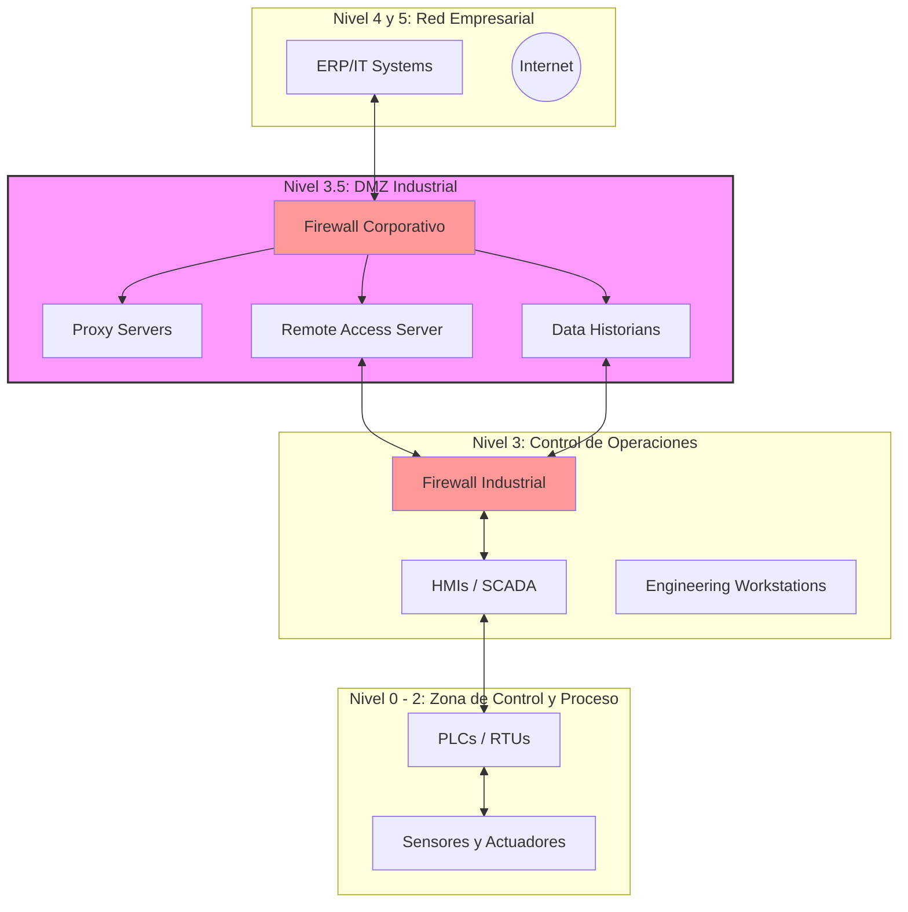

**Definición:** Una zona de red segura que separa los sistemas de TI y OT, facilitando la comunicación y el intercambio de datos seguros. Un segmento de red seguro que aísla las redes de TI corporativas y TO, utilizando cortafuegos para monitorizar y controlar el tráfico entre los dos entornos. Un segmento de red entre la Zona Industrial y la Zona de Empresa utilizado para asegurar y controlar la comunicación. Un área de red segmentada diseñada para unir de forma segura las redes de TI y OT, garantizando un flujo de datos controlado entre ellas.

### Componentes Clave de la IDMZ

* **Firewalls):** Los firewalls controlan el acceso a las redes basándose en las políticas de seguridad de la organización. En la IDMZ, se utilizan para filtrar el tráfico entre la red corporativa y la red de fabricación, permitiendo solo tipos de comunicación específicos y necesarios, y bloqueando transferencias de datos potencialmente dañinas.
* **Data Historians (Historiadores de Datos):** Recopilan y almacenan datos de series temporales provenientes del ICS. Al ubicarlos en la DMZ, las organizaciones pueden permitir el acceso seguro a los datos históricos para análisis e informes sin exponer el ICS directamente a la red empresarial.
* **Servidores Proxy:** Actúan como intermediarios para las solicitudes de clientes que buscan recursos de otros servidores. Pueden proporcionar una capa de seguridad al anonimizar las direcciones de la red interna y filtrar las peticiones.
* **Servidores de Acceso Remoto:** Estos servidores gestionan el acceso remoto seguro a la red OT para fines de mantenimiento y resolución de problemas. Suelen utilizar VPN (Redes Privadas Virtuales) u otros métodos seguros para garantizar que solo el personal autorizado pueda acceder a los sistemas críticos.
* **Servidores de Aplicaciones:** Alojan aplicaciones que necesitan ser accedidas tanto por la red empresarial como por la red OT. Esto puede incluir sistemas de ejecución de manufactura (**MES**), sistemas de planificación de recursos empresariales (**ERP**) y otras aplicaciones críticas.
* **Servidores de Bases de Datos:** Los servidores de bases de datos en la DMZ almacenan datos que deben compartirse entre la red empresarial y las redes OT. Garantizan que se pueda acceder a la información de forma segura sin exponer la red interna de OT.

### Segmentación (Modelo Purdue)

La **IDMZ** actúa como el Nivel 3.5 del Modelo Purdue, sirviendo como una barrera crítica de inspección entre la red de TI (Niveles 4 y 5) y la red de TO (Niveles 0-3). Según **IEC 62443**, esta segmentación define un conducto seguro que protege las "zonas" de control.

* **Punto de Inspección:** Ningún tráfico debe fluir directamente de la Red Corporativa a la Red de Control; todo debe terminar y reanudarse en la IDMZ.
* **Conformidad NIST 800-82:** Se recomienda el uso de firewalls duales (como se muestra en el diagrama) para evitar un único punto de falla en la seguridad.

