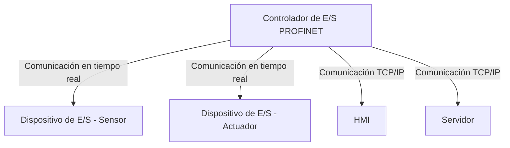

### **PROFINET (Process Field Net)**

**PROFINET** es un estándar de **Ethernet industrial** desarrollado por la organización **PROFIBUS y PROFINET International (PI)**. Se utiliza para la comunicación en sistemas de automatización, ofreciendo alta velocidad y determinismo en tiempo real para aplicaciones críticas.

---

### **Funcionamiento y clases de servicio**

PROFINET se basa en Ethernet estándar, permitiendo la integración con redes de TI y el uso de la infraestructura existente, pero con capacidades extendidas para las exigencias de la industria.

* **Clases de servicio en tiempo real**: PROFINET utiliza diferentes mecanismos para garantizar la comunicación:
    * **RT (Real-Time)**: La clase de servicio estándar y la más común en la mayoría de las aplicaciones de automatización. Prioriza los paquetes de datos de control sobre el tráfico de TCP/IP, logrando una comunicación fiable en milisegundos.
    * **IRT (Isochronous Real-Time)**: La clase de servicio más avanzada para aplicaciones de alta precisión como el control de movimiento y la robótica. Garantiza la comunicación con una precisión de microsegundos mediante una programación de tiempo estricta para el envío de datos.

#### **Detalles de bajo nivel de IRT (Isochronous Real-Time)**

IRT es la clase de servicio más avanzada del protocolo PROFINET. Se utiliza para aplicaciones que requieren una precisión de microsegundos y un determinismo estricto, como el control de movimiento de robots. La clave del rendimiento de IRT reside en su capacidad para programar el tiempo de envío de los datos. La red asigna a cada dispositivo un período de tiempo específico para enviar sus datos, lo que evita la fluctuación y la latencia que pueden producirse en una red Ethernet estándar. Además, los dispositivos IRT suelen utilizar una infraestructura de red dedicada para eliminar la congestión y garantizar un rendimiento óptimo.

---

### **Mecanismos de redundancia**

PROFINET incluye mecanismos de redundancia para garantizar la alta disponibilidad de la red:
* **System Redundancy (S2)**: Permite que dos controladores se comuniquen con el mismo dispositivo. Si el controlador primario falla, el de reserva toma el control del proceso.
* **Media Redundancy (MRP)**: Utiliza una topología de anillo para garantizar que la comunicación continúe si un enlace o un dispositivo falla. El protocolo MRP de PROFINET garantiza un tiempo de recuperación de menos de 200 ms.
* **High-availability Seamless Redundancy (HSR)** y **Parallel Redundancy Protocol (PRP)**: Estos protocolos se utilizan en aplicaciones de alta criticidad, como las subestaciones eléctricas, donde la redundancia es fundamental para la seguridad y la continuidad del servicio.

---

### **Diagramas de arquitectura y flujo de paquetes**

#### **Arquitectura de un sistema PROFINET**

Este diagrama ilustra la estructura de un sistema PROFINET, mostrando el controlador y los dispositivos de E/S en comunicación.



#### **Ciclo de comunicación IRT**

Este diagrama muestra cómo los paquetes de datos de control y de Ethernet estándar se envían en un ciclo de tiempo fijo en una red IRT.

```mermaid
gantt
    title Ciclo de Comunicación PROFINET IRT
    dateFormat  HH:mm:ss.SSS
    axisFormat %L
    section Ciclo de Escaneo (por ejemplo, 1 ms)
    Paquete IRT (Control)  :a1, 0s, 10ms
    Paquete IRT (Control)  :a2, 10ms, 10ms
    Paquete TCP/IP  :a3, 20ms, 10ms
```

### **Dónde buscar más información**

Para profundizar en la tecnología PROFINET, puedes consultar las siguientes fuentes, que ofrecen documentación técnica, herramientas y recursos para su implementación:

* **PROFIBUS y PROFINET International (PI)**: Como la organización creadora del protocolo, su sitio web oficial es la fuente de información más completa y autorizada. Ofrece especificaciones técnicas, documentos de perfil de dispositivo, manuales de implementación y certificaciones.
  * `https://www.profibus-profinet.com/`

* **Siemens PROFINET Documentation**: Siemens, como uno de los principales fabricantes de equipos de automatización, proporciona una amplia documentación sobre cómo implementar PROFINET con sus productos, como los controladores SIMATIC S7 y los equipos de red SCALANCE. Sus manuales detallan la configuración, el diagnóstico y las mejores prácticas para construir redes PROFINET robustas.

* **Certificación PROFINET**: La certificación de un dispositivo PROFINET por parte de PI garantiza que es compatible con el estándar y que funcionará de forma fiable en una red PROFINET. Para una implementación segura, es recomendable utilizar dispositivos certificados.

* **IEC (Comisión Electrotécnica Internacional)**: PROFINET se basa en los estándares de la IEC, como la serie IEC 61158. La documentación de la IEC garantiza su interoperabilidad con otras tecnologías de automatización y es una referencia clave para los ingenieros.
  *  `https://www.iec.ch/`


