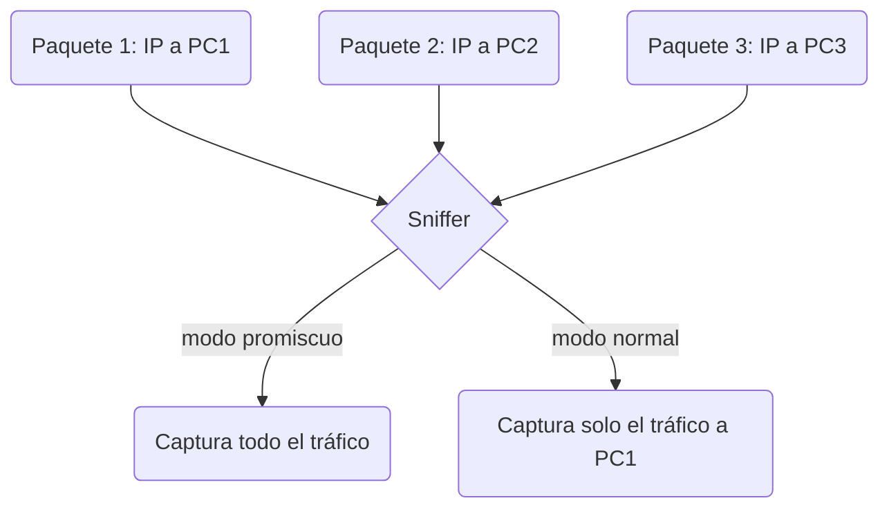

### **Sniffer (Analizador de Protocolo)**

Un **sniffer** es un programa que monitoriza la información que circula por una red con el objetivo de capturar y analizar paquetes de datos. La funcionalidad de un sniffer, también conocido como analizador de protocolo o analizador de paquetes, permite inspeccionar el tráfico de red para diagnosticar problemas, monitorear la seguridad o realizar análisis forense.

---

#### **Funcionamiento y modo promiscuo**

Un sniffer opera colocando la interfaz de red de un dispositivo en **modo promiscuo**. En este modo, la tarjeta de red (NIC) captura todos los paquetes que pasan por el medio de red, incluso aquellos que no están dirigidos a la dirección MAC del propio dispositivo. Una vez capturados, los paquetes pueden ser almacenados en un archivo o mostrados en tiempo real para su análisis.

Sus usos principales incluyen:
* **Diagnóstico de red**: Identificar cuellos de botella, errores de comunicación o problemas de configuración.
* **Monitoreo de seguridad**: Detectar actividades sospechosas, como intentos de intrusión o tráfico malicioso.
* **Análisis forense**: Investigar un incidente de seguridad analizando los datos capturados.

---

#### **Herramientas y librerías clave**

* **Libpcap**: Es una librería de bajo nivel, no un programa para el usuario final. `Libpcap` es la biblioteca fundamental que permite a las aplicaciones capturar paquetes de red de manera portátil en sistemas basados en Unix. En Windows, su equivalente es `WinPcap`. Herramientas como Wireshark y TCPdump se construyen sobre `libpcap`.
* **Ejemplo de código en Rust**: El proyecto de código abierto `secureot-agent` es un ejemplo de un sniffer de red desarrollado en Rust. Este proyecto muestra cómo se utilizan librerías de bajo nivel para crear herramientas de monitoreo personalizadas en entornos de tecnología operativa.
  * **Enlace**: https://github.com/secureot/secureot-agent
* **Wireshark**: La herramienta más popular y poderosa para el análisis de red. Es una aplicación con una interfaz gráfica (GUI) que permite capturar tráfico y mostrarlo de forma detallada, con decodificación de protocolos a múltiples niveles.
* **TShark**: La versión de línea de comandos de Wireshark. Es ideal para automatizar la captura de paquetes o para usarlo en servidores donde no hay una interfaz gráfica disponible.
* **TCPdump**: Un analizador de red clásico de línea de comandos. Es muy ligero y flexible, lo que lo hace ideal para capturas rápidas y el filtrado en tiempo real en sistemas Unix/Linux.

#### **Ejemplos de uso de herramientas**

**Capturar todo el tráfico en una interfaz (eth0):**
`tcpdump -i eth0`

**Capturar y guardar en un archivo para analizar con Wireshark:**
`tcpdump -i eth0 -w captura.pcap`

**Capturar solo el tráfico de un host específico (192.168.1.1):**
`tshark -i eth0 -f "host 192.168.1.1"`

---

#### **Diagrama de funcionamiento del sniffer**

Este diagrama de Mermaid ilustra cómo una interfaz de red en modo promiscuo captura todo el tráfico, incluyendo los paquetes que no van dirigidos a ella.



### **Libpcap y un ejemplo de Sniffer**

**Libpcap** es una librería de bajo nivel, no un programa de usuario final, que proporciona una interfaz para capturar paquetes de red directamente desde una tarjeta de red (NIC). Es la base sobre la que se construyen herramientas populares como Wireshark y tcpdump. Permite a los programadores capturar y filtrar el tráfico de la red, lo que la hace fundamental para el desarrollo de herramientas de monitoreo y análisis de red.

---

#### **Diagrama de funcionamiento de un sniffer basado en Libpcap**

Este diagrama ilustra el rol de `libpcap` como intermediario entre la placa de red y una aplicación de análisis.

```mermaid
graph TD
    A[Tráfico de Red] --> B(Tarjeta de Red<br/>(NIC));
    B --> C(Libpcap<br/>(Librería de captura));
    C --> D[Aplicación de Sniffer<br/>(Ej: tcpdump, Wireshark)];
    D --> E[Análisis y Visualización];
```

##### **Lenguajes con soporte para libpcap**

`Libpcap` es una biblioteca de bajo nivel escrita en C, por lo que su soporte se extiende a otros lenguajes a través de "bindings" o "wrappers" que traducen la API de C a la sintaxis del lenguaje correspondiente. Así que si conoces alguno de los siguientes lenguajes de la lista, puedes jugar fácilmente con `Libpcap`.

* **C / C++**: Tienen soporte nativo, ya que `libpcap` es una biblioteca de C.
* **Python**: Se utiliza con librerías como `pypcap` o `scapy`.
* **Go**: El paquete `gopacket` es una opción popular.
* **Rust**: Cuenta con el crate `pcap`, que proporciona una interfaz segura.
* **Java**: Se puede usar con librerías como `Jpcap` y `Pcap4j`.
* **Node.js**: A través de módulos como `node-pcap`.
* **Perl**: Con módulos como `Net::Pcap`.
